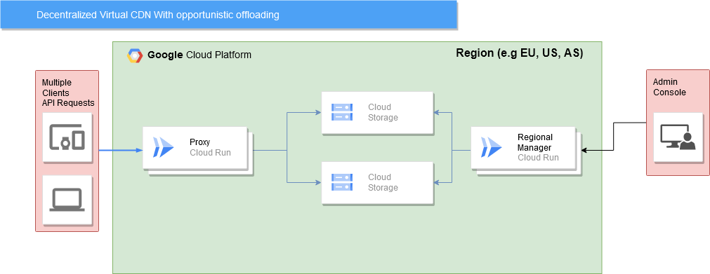

# Cloud Administration

## Goal

A CDN service (like cloudflare and akamai) using google cloud services. Servers are deployed dynamically in several sites to try to ensure an upper limit on latency and also scale horizontally based on the network traffic.

## Requirements

### Functional Requirements

- Admin Client has the ability to upload any file to the CDN,with the option to specify the target region for the file upload. (Not implemented)

- Any regular user can access the CDN to download a specific file.

### Non-Functional Requirements

- **Horizontal Scalibility**: When higher uses of traffic is detected the system should be able to create more replicas on different places in order to not sacrifice availability.

- **Security**: Only the Admin Client should be able to upload files.

## Architecture

### Normal Flow of a file upload

1. Admin Client uploads a file to the CDN (via the Admin Client API).

2. The Admin Client API forwards the request to all the regional managers.

3. Each regional manager adds the file to all the buckets under its authority.

### Normal Flow of a file download

1. User requests a specific file download from the CDN by sending a request to the CDN's endpoint. The request return a proxy/load balancer endpoint, which acts as an intermediary between the user and the CDN infrastructure.

2. The Client App checks its local cache to see if the requested file is already available. If the file is found in the cache, the Proxy directly serves the file to other users. (Not implemented)

3. If the requested file is not available in the local cache, the Proxy checks its replicated buckets to find the file. 

4. Once the file is located, the Proxy retrieves it and starts transferring it to the user over a secure connection.

5. During the file transfer, the user may see a progress indicator showing the download progress, such as the percentage of the file downloaded or the amount of data transferred.

6.  Upon completion of the file transfer, the file is saved to the user's specified location on their local device.

By incorporating a proxy or load balancer, the CDN system can distribute the incoming requests efficiently across multiple servers, balancing the load and improving the overall performance and scalability of the system. 

## Details

- The Admin Client API, the Regional Managers, CDN API and Proxy/Load Balancer are made as containers and executed via google Cloud Run.

- The UPLOAD request (made by the Admin Client to the Admin Client API) is a HTTPS POST request.

<!-- - The Admin Client API also stores the files it receives in a bucket of its own. -->

- Regional Managers are responsible for creating more replicated buckets when network traffic is high to ensure the availability of the system. (not implemented)

### Reasons for this design

- Inter-regions egress fees are more expensive than intra-regions egress fees, so inter-regions data transfers should be minimized as much as possible.

- Since the Admin Client API is a container it can be reduced to zero (via Cloud Run) and only run when a request is made (the same applies to the regional managers).

- Buckets are a relatively inexpensive form of storage (compared to other forms of storage).

<!-- - In the case of synchronization issues all regional managers can depend on the Admin Client API node as a reliable coherent database. -->

- If desired it is also possible to enforce certain policies depending on the region (e.g., EU exclusive content to obey GDPR policies).

# Cost analysis

Cost per cloud run service:

|     Region     | CPU allocation type | CPU | Memory | CPU allocation time | Memory allocation time | Number of requests | Execution Time | Concurrent Requests |   Cost    |
|:--------------:|:------------------:|:---:|:------:|:-------------------:|:----------------------:|:------------------:|:--------------:|:------------------:|:---------:|
|    Europe     |  During Processing |  1  | 1 GiB  |   10,000 vCPU-sec   |     10,000 GiB-sec     |    10,000,000      |    100 ms      |        100         | USD 3.20  |
|    Asia      |  During Processing |  1  | 1 GiB  |   10,000 vCPU-sec   |     10,000 GiB-sec     |    10,000,000      |    100 ms      |        100         | USD 3.20  |
|  America   |  During Processing |  1  | 1 GiB  |   10,000 vCPU-sec   |     10,000 GiB-sec     |    10,000,000      |    100 ms      |        100         | USD 3.20  |

Cost per bucket service:

|     Region     | Total Amount of Storage | Class A operations | Inter-region Egress  |   Cost    |
|:--------------:|:------------------:|:---:|:------:|:-------------------:|
|    Europe | 1,024 GiB | 1 million |  Europe: 100 GiB   | USD 27.48 |
|    Asia | 1,024 GiB | 1 million |  Asia: 100 GiB   | USD 36.55 |
|    America | 1,024 GiB | 1 million |  North America: 100 GiB   | USD 30.55 |

Total cost of the project:

| Count | Region |    Cloud-Run     | Storage |  Cost    |
|:--------------:|:--------------:|:------------------:|:---:|:------:|
|  2  | Europe | USD 6.4 | USD 54,96 | USD 61,36 |
|  1  | Asia | USD 3.2 | - | USD 3.2 |
|  1  | Asia | USD 3.2 | - | USD 3.2 |
|  1  | America | USD 3.2 | - | USD 3.2 |
|  2  | Asia | - | USD 73.1 | USD 73.1 |
|  2  | America | - | USD 61.1 | USD 61.1 |
|  -  | - | - | - | USD 205,16 |
