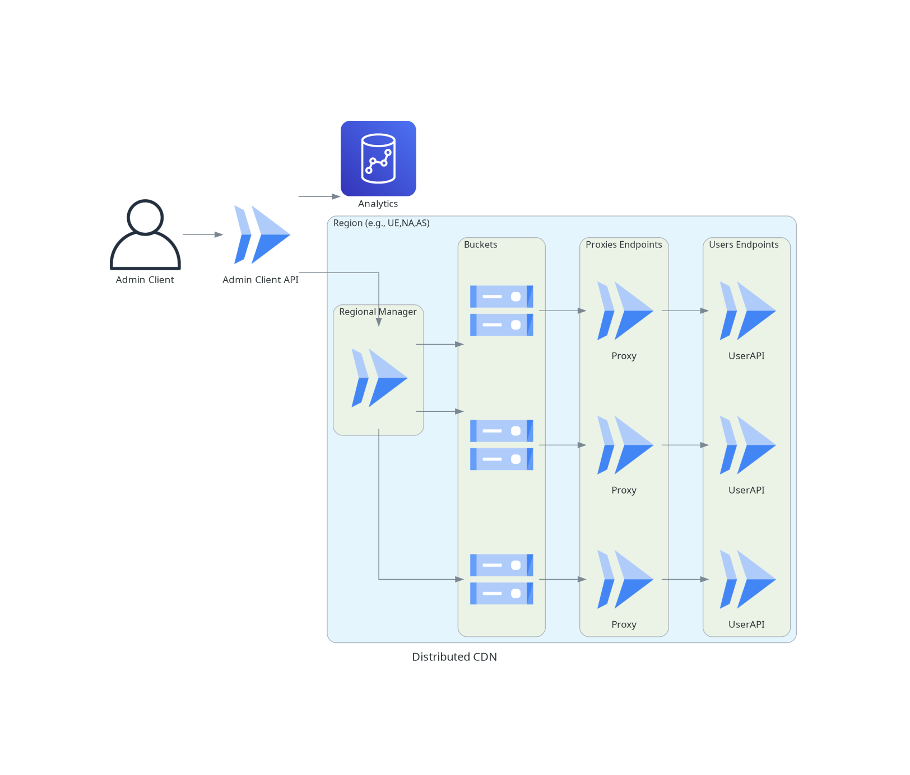

# Cloud Administration

## Goal

A CDN service (like cloudfare and akamai) using google cloud services. Servers are deployed dynamically in several sites to try to ensure an upper limit on latency and also scale horizontally based on the network traffic.

## Requirements

### Functional Requirements

- Admin Client has the ability to upload any file to the CDN.

- Any regular user can access the CDN to download a specific file.

### Non-Functional Requirements

- **Horizontal Scalibility**: When higher uses of traffic is detected the system should be able to create more replicas on different places in order to not sacrifice availability.

- **Security**: Only the Admin Client should be able to upload files.


## Architecture



### Normal Flow of a file upload

1. Admin Client uploads a file to the CDN (via the Admin Client API).

2. The Admin Client API forwards the request to all the regional managers.

3. Each regional manager adds the file to all the buckets under its authority.

### Normal Flow of a file download

**To be done and added to the architecture** 

### Details

- The Admin Client API and the Regional Managers are made as containers and executed via google Cloud Run.

- The UPLOAD request (made by the Admin Client to the Admin Client API) is a HTTPS POST request.

<!-- - The Admin Client API also stores the files it receives in a bucket of its own. -->

- Regional Managers are responsible for creating more replicated buckets when network traffic is high to ensure the availability of the system.

### Reasons for this design

- Inter-regions egress fees are more expensive than intra-regions egress fees, so inter-regions data transfers should be minimized as much as possible.

- Since the Admin Client API is a container it can be reduced to zero (via Cloud Run) and only run when a request is made (the same applies to the regional managers).

- Buckets are a relatively inexpensive form of storage (compared to other forms of storage).

<!-- - In the case of synchronization issues all regional managers can depend on the Admin Client API node as a reliable coherent database. -->

- If desired it is also possible to enforce certain policies depending on the region (e.g., EU exclusive content to obey GDPR policies).

# Trivia

### Download a file from a bucket

```bash
https://storage.googleapis.com/download/storage/v1/b/{BUCKET_NAME}/o/{FILENAME}?alt=media
```

**Download file.txt from the bucket decentrilized-cdn-na-east-1:**

```bash
https://storage.googleapis.com/download/storage/v1/b/decentrilized-cdn-na-east-1/o/text.txt?alt=media
```

### Make bucket readable for everyone

```bash
gsutil iam ch allUsers:objectViewer gs://{BUCKET_NAME}
```

# Questions

- [x] ~~What's the latency's required upper bound? When can we consider a server close enough to the user? Is one server (with horizontal scaling) for each region enough?~~

- [x] ~~Do we need to preserve the file name of a certain file (since a UPLOAD request of a file returns a hash) when an ordinary user downloads it?~~ Yes the file name should be preserved

- [x] ~~How does the admin client upload a file? Is it via a HTTP POST request, GUI, local program, ...?~~ Usually it's a REST API call.

- [x] ~~How i authenticate the Admin Client? SSL Client Certificates, Token-based Auth, ...~~ OAuth 2.0
